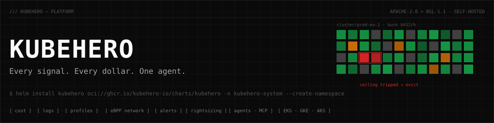

# KubeHero



**Open-source Kubernetes observability and FinOps in one install** — cost allocation, logs, continuous profiling, eBPF network cost, alerting, guarded rightsizing and read-only AI agents for AKS, GKE and EKS. Self-hosted; nothing leaves your cluster.

```bash
helm install kubehero oci://ghcr.io/kubehero-io/charts/kubehero \
  -n kubehero-system --create-namespace
```

One DaemonSet and one control plane replace the stack most teams stitch together:

| You'd otherwise run | KubeHero gives you |
| --- | --- |
| OpenCost / Kubecost | Cost allocation by any dimension with idle + shared cost, CPU/RAM/GPU/network split, an **OpenCost-compatible API**, FinOps **FOCUS** export, chargeback, forecasts |
| Loki + Promtail | Container log collection, **LogQL** (filters, parsers, metric queries), live tail, pattern mining, log $ per team — **Loki push + query API**, OTLP/HTTP logs |
| Pyroscope + profiling agents | **eBPF** whole-node CPU profiling with no code changes, pprof scraping, **Pyroscope** ingest, flamegraphs, diff flamegraphs, **$/month per function** |
| Network observability | eBPF flow map with **cross-zone and internet egress $**, TCP retransmits |
| VPA / rightsizing tools | Percentile rightsizing from measured usage, applied only through **guarded, human-armed** `RightsizingPolicy` CRDs — bounded, OOM-aware, reversible |
| Alertmanager rules sprawl | One alert engine over logs, spend, budget burn, anomalies, network $ and cluster events → Slack, PagerDuty, Opsgenie, Teams, webhooks, Alertmanager |
| — | **Agents**: daily briefings (text + voice), "Ask KubeHero" investigations that cite evidence, and an **MCP server** so Claude can query your fleet — read-only, BYO Anthropic key |

It keeps what you already run: Prometheus scrapes it, Grafana reads its logs as a Loki datasource, OpenCost consumers read its allocation API.

## Quickstart

```bash
# 1. install (embedded Postgres + ClickHouse, auth on)
helm install kubehero oci://ghcr.io/kubehero-io/charts/kubehero -n kubehero-system --create-namespace

# 2. your admin token
kubectl -n kubehero-system get secret kubehero-kubehero-control-plane \
  -o jsonpath='{.data.admin-token}' | base64 -d; echo

# 3. the dashboard (sign in with the token)
kubectl -n kubehero-system port-forward svc/kubehero-kubehero-dashboard 3001:3001
```

No cluster handy? `docker compose up --build -d` runs the whole stack locally with a synthetic three-cluster fleet streamed through the real ingest APIs, then open http://localhost:3001.

## Layout

```
apps/        dashboard · docs
services/    control-plane · collector · operator · advisor · pricing-engine
cli/         kubehero (CLI + MCP server)
packages/    proto · cost-model · tsconfig
deploy/      helm · terraform
infra/       demo (compose, kind e2e, telemetry generator) · dagger
```

Architecture, guardrails and honest limits: [`ARCHITECTURE.md`](ARCHITECTURE.md). Docs: <https://kubehero.io/docs>.

## Development

```bash
task build              # every Go module + TS workspace
task test               # go test ./... everywhere
task proto              # buf lint + generate (plugins pinned)
task helm:lint
docker compose up --build -d            # full stack + demo fleet
./infra/demo/e2e-kind.sh                # real chart on kind, every signal asserted
```

See [`LOCAL_DEV.md`](LOCAL_DEV.md) and [`CONTRIBUTING.md`](CONTRIBUTING.md).

## Licensing

Open source and free to self-host.

- Apache 2.0 — CLI, collector, cost-model, proto
- BSL 1.1 — control plane, operator, advisor, pricing engine, dashboard (source-available, free to run yourself)
